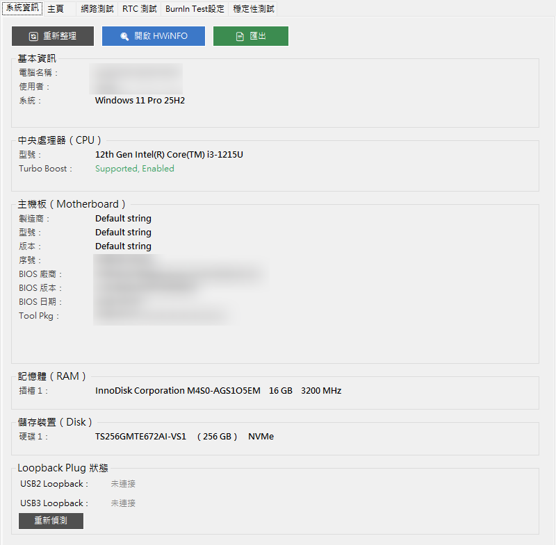
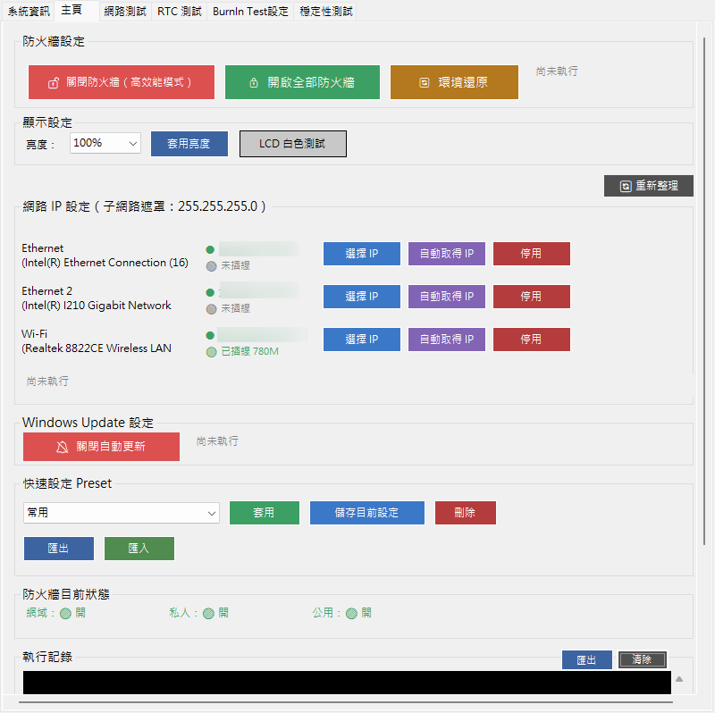
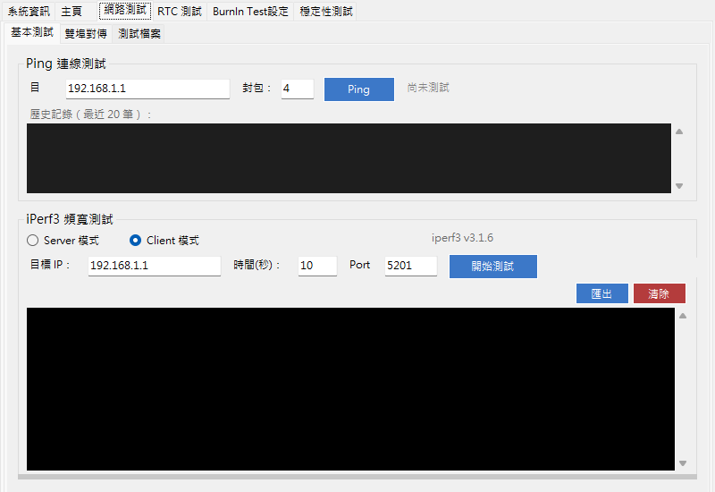
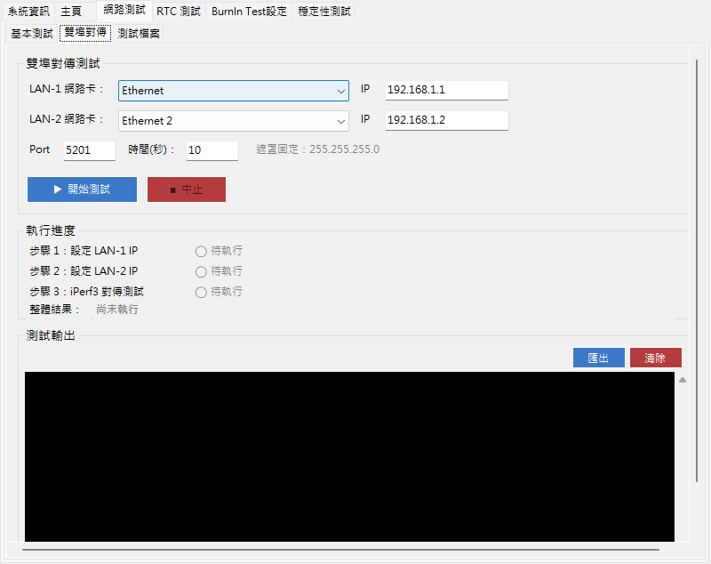
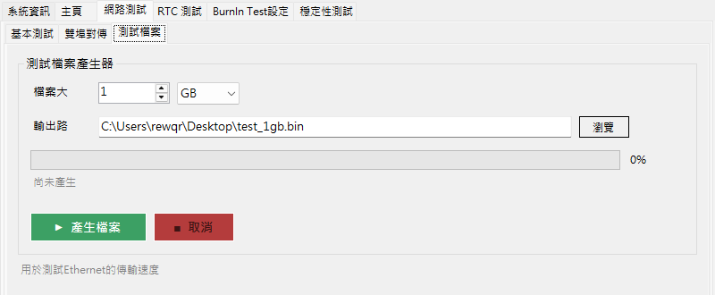
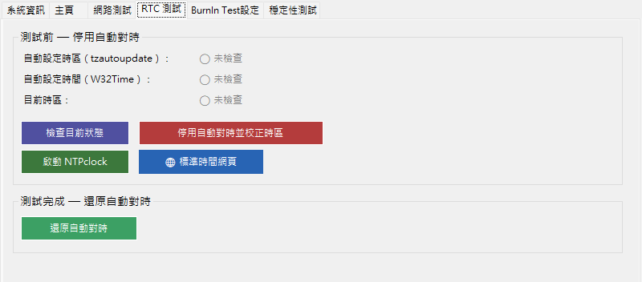
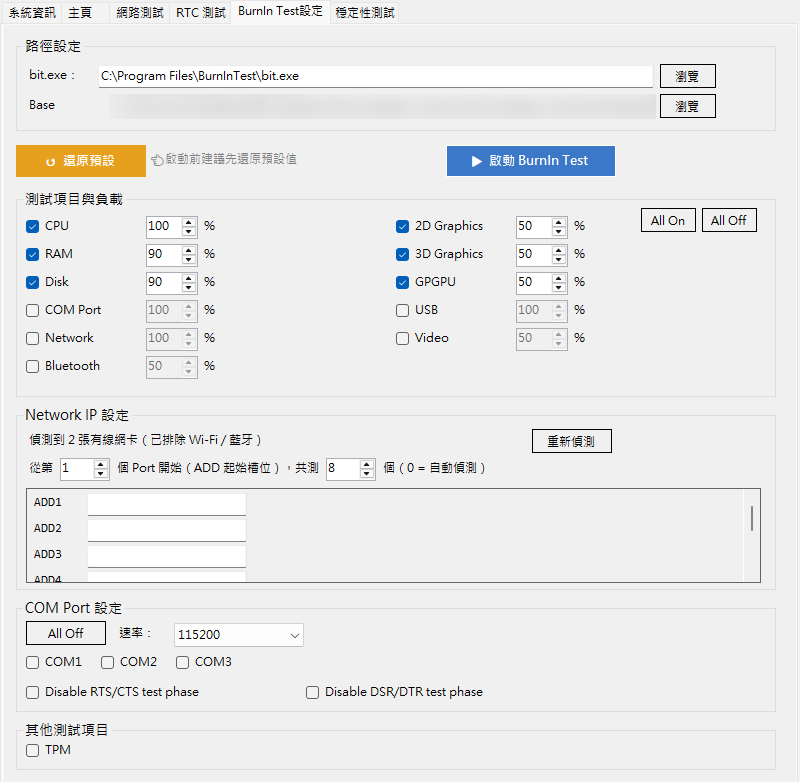
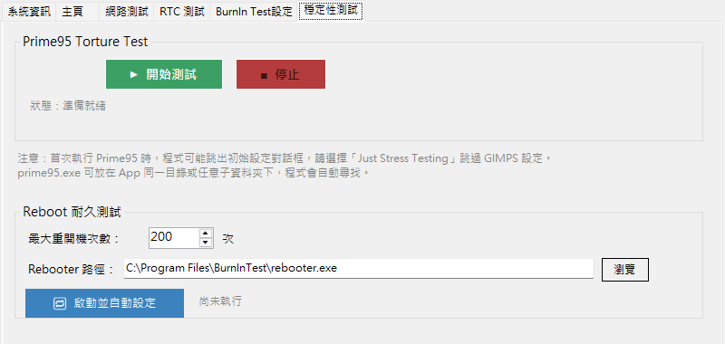
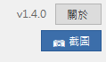

# DQA-Test-Tool

Windows WinForms 驗證輔助工具，整合 DQA 驗證流程中常用的系統資訊查詢、網路測試、RTC 測試與壓力測試，減少重複的手動設定作業。

> 本工具為公司內部使用的驗證輔助工具，原始碼因保密不公開，此頁僅介紹功能與開發方式。

## 功能介紹

### 系統資訊

查詢 CPU、主機板、BIOS、RAM、儲存裝置資訊，支援 HTML 報告匯出，可一鍵啟動 HWiNFO，並偵測 USB Loopback 連接狀態。

### 主頁

防火牆與顯示設定、網卡 IP 設定（靜態 / DHCP）、Windows Update 設定，以及網路設定組合（Preset）的儲存與載入。

### 網路測試

分為三個子頁籤：

**基本測試**：Ping 連線測試與 iPerf3 頻寬測試（Client / Server 模式）。

**雙埠對傳**：選擇兩張網卡並設定 IP，自動串接 IP 設定與 iPerf3 對傳測試，並顯示各步驟執行進度。

**測試檔案**：產生指定大小的測試用檔案，用於測試乙太網路實際傳輸速度。

### RTC 測試

協助進行 RTC 走時精度量測：測試前停用自動對時，測試完成後一鍵還原系統時間設定。

### BurnIn 設定

圖形化設定 PassMark BurnInTest 的測試項目與負載，自動產生腳本並啟動。

### 穩定性測試

Prime95 壓力測試啟動，以及 Reboot 耐久測試（PassMark Rebooter 自動化設定）。

另提供版本資訊（關於）與畫面截圖功能，所有分頁皆可使用。

## 開發方式

使用 **Claude Code (CLI)** 進行 AI-assisted 開發（Vibe Coding）：

1. 先以 Plan Mode 與 AI 討論並確認實作方案
2. 實作完成後逐項驗證輸出結果
3. 依實際驗證需求持續迭代功能

## 成果

- 驗證環境建置時間縮短 **70% 以上**
- 已推廣至團隊使用

## 技術環境

- C# / .NET 8 / WinForms
- Windows 10 / 11
